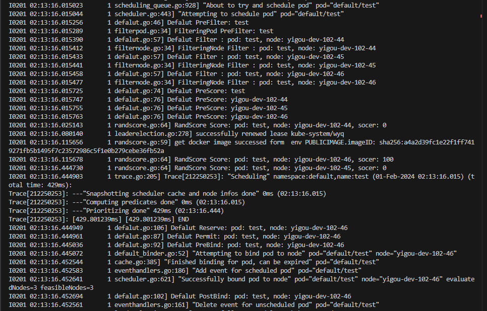

# Wyq-Scheduler

通过k8s的scheduling framework实现一个自定义调度器Wyq-Scheduler

目标: 了解k8s pod调度的流程，了解每个扩展点的功能。
## 开始
- 构建 Wyq-Scheduler
```shell
make push 
```
- 部署 Wyq-Scheduler:
```shell
kubectl apply -f deploy/
```
- 检查调度器状态:
```shell
kubectl get pods -n kube-system 
```
- 部署测试pod

```shell
kubectl apply -f example/test-pod.yaml
```
## 调度流程
- 查看调度器的调度日志
```
# kubectl logs -f -n kube-system pod/test-scheduling-6bff584984-c4xg4
# ...
# I1117 05:56:05.241710       1 scheduler.go:443] "Attempting to schedule pod" pod="default/test"
# I1117 05:56:05.242050       1 scheduler.go:47] PreFilter: test
# I1117 05:56:05.242180       1 scheduler.go:60] Filter : pod: test, node: yigou-dev-102-45
# I1117 05:56:05.242192       1 scheduler.go:60] Filter : pod: test, node: yigou-dev-102-46
# I1117 05:56:05.243484       1 scheduler.go:80] PreScore: test
# I1117 05:56:05.243516       1 scheduler.go:82] PreScore: yigou-dev-102-45
# I1117 05:56:05.243526       1 scheduler.go:82] PreScore: yigou-dev-102-46
# I1117 05:56:05.243619       1 scheduler.go:88] Score: pod: test, node: yigou-dev-102-45
# I1117 05:56:05.243662       1 scheduler.go:88] Score: pod: test, node: yigou-dev-102-46
# I1117 05:56:05.243766       1 scheduler.go:98] NormalizeScore: pod: test
# I1117 05:56:05.243949       1 scheduler.go:122] Reserve: pod: test, node: yigou-dev-102-46
# I1117 05:56:05.244022       1 scheduler.go:103] Permit: pod: test, node: yigou-dev-102-46
# I1117 05:56:05.244097       1 scheduler.go:108] PreBind: pod: test, node: yigou-dev-102-46
# I1117 05:56:05.244159       1 default_binder.go:52] "Attempting to bind pod to node" pod="default/test" node="yigou-dev-102-46"
# I1117 05:56:05.275976       1 cache.go:385] "Finished binding for pod, can be expired" pod="default/test"
# I1117 05:56:05.276040       1 scheduler.go:621] "Successfully bound pod to node" pod="default/test" node="yigou-dev-102-46" evaluatedNodes=3 feasibleNodes=2
# I1117 05:56:05.276079       1 scheduler.go:118] PostBind: pod: test, node: yigou-dev-102-46
# I1117 05:56:05.276213       1 eventhandlers.go:161] "Delete event for unscheduled pod" pod="default/test"
# I1117 05:56:05.276327       1 eventhandlers.go:186] "Add event for scheduled pod" pod="default/test"
```

- 查看调度器生成的配置文件(不同阶段插件实现是k8s默认插件和自定义插件的并集)
```
-------------------------Configuration File Contents Start Here---------------------- 
apiVersion: kubescheduler.config.k8s.io/v1beta2
clientConnection:
  acceptContentTypes: ""
  burst: 100
  contentType: application/vnd.kubernetes.protobuf
  kubeconfig: ""
  qps: 50
enableContentionProfiling: true
enableProfiling: true
healthzBindAddress: ""
kind: KubeSchedulerConfiguration
leaderElection:
  leaderElect: false
  leaseDuration: 15s
  renewDeadline: 10s
  resourceLock: leases
  resourceName: kube-scheduler
  resourceNamespace: kube-system
  retryPeriod: 2s
metricsBindAddress: ""
parallelism: 16
percentageOfNodesToScore: 0
podInitialBackoffSeconds: 1
podMaxBackoffSeconds: 10
profiles:
- pluginConfig:
  - args:
      apiVersion: kubescheduler.config.k8s.io/v1beta2
      kind: DefaultPreemptionArgs
      minCandidateNodesAbsolute: 100
      minCandidateNodesPercentage: 10
    name: DefaultPreemption
  - args:
      apiVersion: kubescheduler.config.k8s.io/v1beta2
      hardPodAffinityWeight: 1
      kind: InterPodAffinityArgs
    name: InterPodAffinity
  - args:
      apiVersion: kubescheduler.config.k8s.io/v1beta2
      kind: NodeAffinityArgs
    name: NodeAffinity
  - args:
      apiVersion: kubescheduler.config.k8s.io/v1beta2
      kind: NodeResourcesBalancedAllocationArgs
      resources:
      - name: cpu
        weight: 1
      - name: memory
        weight: 1
    name: NodeResourcesBalancedAllocation
  - args:
      apiVersion: kubescheduler.config.k8s.io/v1beta2
      kind: NodeResourcesFitArgs
      scoringStrategy:
        resources:
        - name: cpu
          weight: 1
        - name: memory
          weight: 1
        type: LeastAllocated
    name: NodeResourcesFit
  - args:
      apiVersion: kubescheduler.config.k8s.io/v1beta2
      defaultingType: System
      kind: PodTopologySpreadArgs
    name: PodTopologySpread
  - args:
      apiVersion: kubescheduler.config.k8s.io/v1beta2
      bindTimeoutSeconds: 600
      kind: VolumeBindingArgs
    name: VolumeBinding
  plugins:
    bind:
      enabled:
      - name: DefaultBinder
        weight: 0
      - name: defalut
        weight: 0
    filter:
      enabled:
      - name: NodeUnschedulable
        weight: 0
      - name: NodeName
        weight: 0
      - name: TaintToleration
        weight: 0
      - name: NodeAffinity
        weight: 0
      - name: NodePorts
        weight: 0
      - name: NodeResourcesFit
        weight: 0
      - name: VolumeRestrictions
        weight: 0
      - name: EBSLimits
        weight: 0
      - name: GCEPDLimits
        weight: 0
      - name: NodeVolumeLimits
        weight: 0
      - name: AzureDiskLimits
        weight: 0
      - name: VolumeBinding
        weight: 0
      - name: VolumeZone
        weight: 0
      - name: PodTopologySpread
        weight: 0
      - name: InterPodAffinity
        weight: 0
      - name: defalut
        weight: 0
      - name: filteringNode
        weight: 0
    multiPoint: {}
    permit:
      enabled:
      - name: defalut
        weight: 0
    postBind:
      enabled:
      - name: defalut
        weight: 0
    postFilter:
      enabled:
      - name: DefaultPreemption
        weight: 0
      - name: defalut
        weight: 0
    preBind:
      enabled:
      - name: VolumeBinding
        weight: 0
      - name: defalut
        weight: 0
    preFilter:
      enabled:
      - name: NodeResourcesFit
        weight: 0
      - name: NodePorts
        weight: 0
      - name: VolumeRestrictions
        weight: 0
      - name: PodTopologySpread
        weight: 0
      - name: InterPodAffinity
        weight: 0
      - name: VolumeBinding
        weight: 0
      - name: NodeAffinity
        weight: 0
      - name: defalut
        weight: 0
      - name: filteringPod
        weight: 0
    preScore:
      enabled:
      - name: InterPodAffinity
        weight: 0
      - name: PodTopologySpread
        weight: 0
      - name: TaintToleration
        weight: 0
      - name: NodeAffinity
        weight: 0
      - name: defalut
        weight: 0
    queueSort:
      enabled:
      - name: PrioritySort
        weight: 0
    reserve:
      enabled:
      - name: VolumeBinding
        weight: 0
      - name: defalut
        weight: 0
    score:
      enabled:
      - name: NodeResourcesBalancedAllocation
        weight: 1
      - name: ImageLocality
        weight: 1
      - name: InterPodAffinity
        weight: 1
      - name: NodeResourcesFit
        weight: 1
      - name: NodeAffinity
        weight: 1
      - name: PodTopologySpread
        weight: 2
      - name: TaintToleration
        weight: 1
      - name: randScore
        weight: 300
  schedulerName: wyq
```
# 镜像调度（实战）
问题背景：在机器学习平台需要对镜像进行重新构建，如果将构建任务pod调度到存在镜像的节点，可加快镜像的构建速度。

## 测试结果（镜像调度）
